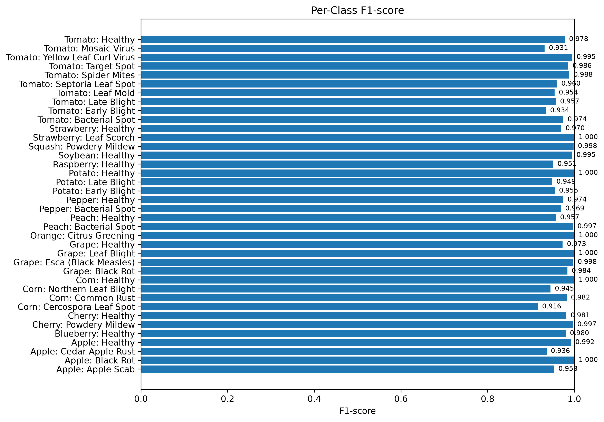

# AI-Powered Plant Disease Detection and Classification System


A practical computer vision project for plant disease detection from leaf images, built with PyTorch and ResNet18 transfer learning. The project covers the full machine learning workflow: dataset preparation, stratified splitting, class imbalance handling, model training, fine-tuning, and evaluation.

I developed this as my MSc Software Engineering final project, with the goal of making the work easy to understand, reproduce, and review. Alongside the main notebook, the repository includes modular Python scripts, exported metrics, and visual results used in the final report.

## At a glance

| Area | Details |
|---|---|
| Task | Multi-class plant leaf disease classification |
| Framework | PyTorch |
| Model | ResNet18 with ImageNet-pretrained weights |
| Dataset | PlantVillage, 15 classes |
| Images used | 20,638 |
| Final test accuracy | 97.38% |
| Final macro F1-score | 0.9718 |
| Final weighted F1-score | 0.9737 |

## Why I built this

Plant diseases can reduce crop quality and yield, and visual diagnosis is difficult to scale when many plants need to be checked. Computer vision can help by providing a fast first-pass classification from leaf images.

For this project, I wanted to focus on the full machine learning process instead of only showing a final accuracy score. That meant building a workflow that includes data inspection, preprocessing, training, evaluation, and clear visual reporting.

## Results

The model was trained in two phases. In the first phase, the ResNet18 backbone was frozen and only the classification head was trained. In the second phase, the full model was fine-tuned.

| Phase | Training setup | Test accuracy | Macro F1-score | Weighted F1-score |
|---|---|---:|---:|---:|
| Phase 1 | Frozen backbone | 82.17% | 0.7914 | 0.8301 |
| Phase 2 | Full fine-tuning | **97.38%** | **0.9718** | **0.9737** |

The final model performs strongly on the controlled PlantVillage test set. I included macro F1-score because accuracy alone can hide weaker performance on smaller classes.

## Visual evaluation

### Training curves


### Confusion matrix


### Per-class F1-score



## Dataset

The project uses a processed PlantVillage image dataset with 15 classes.

| Split | Images |
|---|---:|
| Training | 14,446 |
| Validation | 3,096 |
| Test | 3,096 |
| Total | 20,638 |

| Dataset property | Value |
|---|---:|
| Number of classes | 15 |
| Largest class count | 3,208 |
| Smallest class count | 152 |
| Imbalance ratio | 21.11 |

The dataset is not included in this repository because of size and licensing considerations. To run the project locally, place the dataset in the `data/` directory using an image-folder layout:

```text
data/
└── PlantVillage/
    ├── Class_1/
    ├── Class_2/
    ├── Class_3/
    └── ...
```

## Method

The workflow follows these steps:

1. Inspect the dataset and class distribution
2. Prepare image transformations and augmentation
3. Create stratified train, validation, and test splits
4. Train a ResNet18 classifier with transfer learning
5. Fine-tune the full network
6. Evaluate the final model on a held-out test set
7. Export classification reports, comparison tables, and figures

## Model details

| Item | Value |
|---|---|
| Architecture | ResNet18 |
| Pretraining | ImageNet |
| Input size | 224 × 224 |
| Loss function | Class-weighted cross-entropy |
| Main metric focus | Accuracy, macro F1-score, weighted F1-score |
| Additional evaluation | Precision, recall, classification report, confusion matrix |

## Repository structure

```text
ai-plant-disease-detection/
├── notebooks/
│   └── 01_full_pipeline.ipynb
├── src/
│   ├── dataset.py
│   ├── evaluate.py
│   ├── model.py
│   ├── train.py
│   └── utils.py
├── results/
│   ├── classification_report_phase2_clean.csv
│   ├── final_project_summary.csv
│   └── phase1_phase2_comparison.csv
├── figures/
│   ├── training_curves_phase2.png
│   ├── confusion_matrix_phase2.png
│   └── per_class_f1_phase2.png
├── requirements.txt
├── README.md
└── .gitignore
```

## Running the project

Create and activate a virtual environment:

```bash
python3 -m venv venv312
source venv312/bin/activate
```

Install dependencies:

```bash
pip install -r requirements.txt
```

Open the main notebook:

```bash
jupyter notebook notebooks/01_full_pipeline.ipynb
```

The notebook contains the full workflow, from loading the dataset to exporting the final result files.

## Source files

| File | Purpose |
|---|---|
| `src/dataset.py` | Dataset loading and split preparation |
| `src/model.py` | ResNet18 model setup |
| `src/train.py` | Training and fine-tuning logic |
| `src/evaluate.py` | Evaluation and report generation |
| `src/utils.py` | Shared utility functions |

## What is not included

The repository intentionally excludes large or local-only files:

- the full dataset
- virtual environment folders
- trained `.pth` checkpoints
- local archive folders
- temporary smoke-test outputs

This keeps the repository easier to review and clone.

## Limitations

The results are strong for controlled PlantVillage-style images, where leaves are usually photographed in clean conditions. Real-world use would require more testing on field images with natural backgrounds, different lighting, camera noise, partial leaves, overlapping leaves, and different disease stages.

This repository should be read as a reproducible academic computer vision pipeline, not as a production farming diagnostic system.

## Next steps

The most useful improvements would be:

- test the model on real-world field images
- compare ResNet18 with EfficientNet or ResNet50
- add Grad-CAM visual explanations
- build a small inference API or web demo
- export the model for mobile or edge-AI use
- expand the dataset with more plant species and uncontrolled image conditions

## Author

**Shadi Mansoori Rad**  
MSc Software Engineering  
ORCID: [0009-0003-7262-527X](https://orcid.org/0009-0003-7262-527X)
