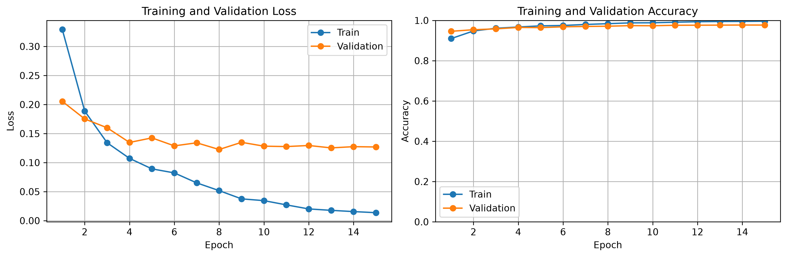
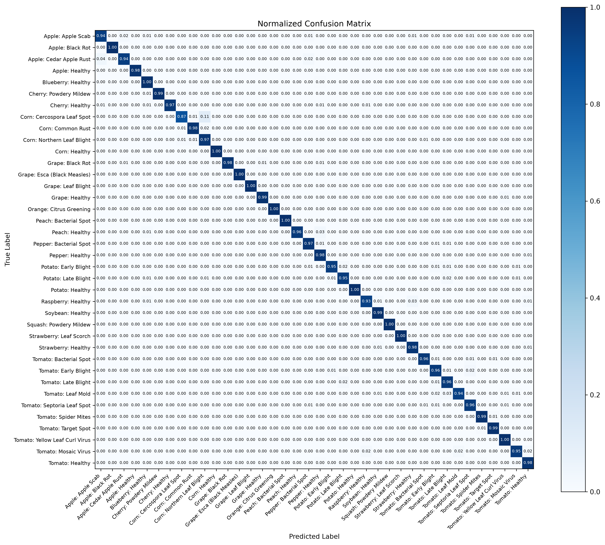

# PlantDoctor AI


A practical computer vision and web deployment project for plant disease detection from leaf images, built with PyTorch, ResNet18 transfer learning, and FastAPI. The project covers the full machine learning workflow: hybrid dataset preparation, stratified splitting, model training, fine-tuning, Grad-CAM visualization, and web deployment.

I developed this as an Artificial Intelligence application project for my Software Engineering major, with the goal of making the work easy to understand, reproduce, and use via a web interface. Alongside the main notebook, the repository includes modular Python scripts, an active FastAPI backend, and a Vanilla JS frontend interface.

## At a glance

| Area | Details |
|---|---|
| Task | Multi-class plant leaf disease classification |
| Framework | PyTorch & FastAPI |
| Model | ResNet18 with ImageNet-pretrained weights + Grad-CAM |
| Dataset | PlantVillage + PlantDoc (Hybrid) |
| Images used | 54,305 |
| Final test accuracy | 98,16% |
| Final macro F1-score | 97,39% |
| Final weighted F1-score | 98,16% |

## Why I built this

Plant diseases can reduce crop quality and yield, and visual diagnosis is difficult to scale when many plants need to be checked. Computer vision can help by providing a fast first-pass classification from leaf images.

For this project, I wanted to focus on a complete pipeline instead of only showing a final accuracy score. That meant building a workflow that includes data merging, preprocessing, training, visual reporting (Explainable AI via Grad-CAM), and a usable Web API for end-users.

## Results

The model was trained in two phases. In the first phase, the ResNet18 backbone was frozen and only the classification head was trained. In the second phase, the full model was fine-tuned.

| Phase | Training setup | Test accuracy | Macro F1-score | Weighted F1-score |
|---|---|---:|---:|---:|
| Phase 1 | Frozen backbone | 88,78% | 85,49% | 89,04% |
| Phase 2 | Full fine-tuning | **98,16%** | **97,39%** | **98,16%** |

The final model performs strongly on the combined hybrid test set. I included macro F1-score because accuracy alone can hide weaker performance on smaller classes.

## Visual evaluation

### Training curves



### Confusion matrix



### Per-class F1-score


## Dataset

The project uses a hybrid dataset combining controlled laboratory images (PlantVillage) and real-world field images (PlantDoc).

| Split | Images |
|---|---:|
| Training | 43,444 |
| Validation | 5,430 |
| Test | 5,431 |
| Total | 54,305 |

| Dataset property | Value |
|---|---:|
| Number of classes | 38 |
| Largest class count | 5507 |
| Smallest class count | 152 |
| Imbalance ratio | 36.23% |

The dataset is not included in this repository because of size and licensing considerations. To run the project locally, run the provided `merge_data.py` script to structure the `data/` directory using an image-folder layout:

```text
data/
└── PlantVillage/
    ├── pd_train_...
    ├── Tomato___Bacterial_spot/
    └── ...
```

## Method

The workflow follows these steps:

1. Inspect the datasets and class distribution
2. Merge PlantVillage and PlantDoc into a hybrid dataset via Python scripts
3. Prepare image transformations and augmentation
4. Create stratified train, validation, and test splits
5. Train a ResNet18 classifier with transfer learning
6. Extract Grad-CAM heatmaps for Explainable AI (XAI)
7. Deploy the model using a FastAPI backend and HTML/JS frontend

## Model details

| Item | Value |
|---|---|
| Architecture | ResNet18 |
| Pretraining | ImageNet |
| Input size | 224 × 224 |
| Loss function | Class-weighted cross-entropy |
| Web API | FastAPI + Uvicorn |
| Explainability | Gradient-weighted Class Activation Mapping (Grad-CAM) |
## Repository structure

```text
plant-disease-ai/
├── data/                       
├── docs/                       
├── frontend/                   
│   ├── index.html
│   ├── script.js
│   └── style.css
├── models/                     
│   └── resnet18_phase2_best.pth
├── notebooks/                  
│   ├── 01_full_pipeline.ipynb
│   ├── 02_demo.ipynb
│   └── 03_demoRad.ipynb
├── results/                    
├── scripts/                    
│   └── merge_data.py
├── src/                        
│   ├── dataset.py
│   ├── disease_database.py
│   ├── evaluate.py
│   ├── gradcam.py
│   ├── load_model.py
│   ├── model.py
│   ├── train.py
│   └── utils.py
├── app.py                      
├── requirements.txt            
└── .gitignore
```

## Source files

| File | Purpose |
|---|---|
| `app.py` | FastAPI server entry point |
| `scripts/merge_data.py` | Combines PlantDoc and PlantVillage datasets |
| `src/gradcam.py` | Heatmap generation logic |
| `src/disease_database.py` | JSON database lookup for frontend results |
| `src/train.py` | Training and fine-tuning logic |

## What is not included

The repository intentionally excludes large or local-only files:

- the full dataset (`data/`)
- virtual environment folders (`venv/`)
- local archive folders

This keeps the repository easier to review and clone.

## Next steps

The most useful improvements would be:

- Evaluate the hybrid model's robustness on a completely unseen third-party dataset
- Expand the detection system to include livestock and poultry diseases via YOLO object detection
- Compare ResNet18 performance with EfficientNet-B0 or MobileNetV3 for faster edge inference